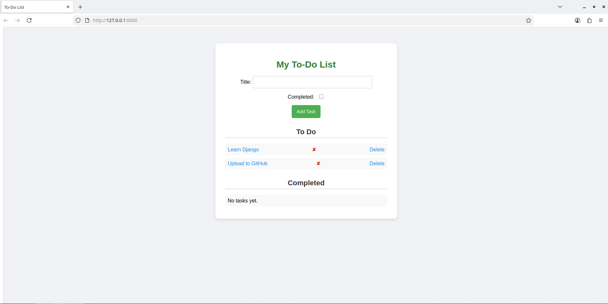

# 📝 Django To-Do List

A simple and functional To-Do List web application built with Django.  
You can add tasks, mark them as completed, and delete them.  

---

## 🚀 Features
- ✅ Add new tasks  
- 🔄 Mark tasks as completed or move them back to To-Do  
- ❌ Delete tasks  
- 🎨 Simple and clean UI with CSS styling

---

## 📷 Screenshots

### **Main Page**


---

## 🛠️ Installation & Run

1. **Clone the repository:**

```bash

git clone git@github.com:MeloRegon/Django_ToDoList.git
```

2. **Navigate to the project directory:**

```bash

cd Django_ToDoList
```

3. **Create and activate a virtual environment (recommended):**

```bash

python3 -m venv venv
source venv/bin/activate  # On Linux/Mac
venv\Scripts\activate     # On Windows
```

4. **Install dependencies:**

```bash

pip install -r requirements.txt
```

5. **Run migrations:**

```bash

python manage.py migrate
```

6. **Start the server:**

```bash

python manage.py runserver
```

7.  **Open in browser:**

 http://127.0.0.1:8000/

---

## 🧩 Tech Stack
- Python 3.8+
- Django 5.2.3
- SQLite3 (default database)

---

## 📌 Future Improvements
- Adding user authentication
- Improving the UI with Bootstrap
- Adding due dates and task categories

---

## ✨ Author
Yahor Miarzlou (MeloRegon)  
[GitHub Profile](https://github.com/MeloRegon)